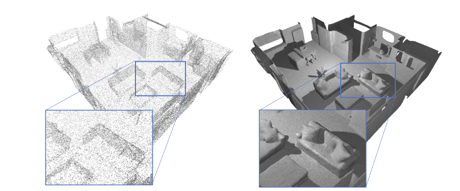

# Neural Unsigned Distance Fields
> Neural Unsigned Distance Fields for Implicit Function Learning <br />
> [Julian Chibane](http://virtualhumans.mpi-inf.mpg.de/people/Chibane.html), [Aymen Mir](http://virtualhumans.mpi-inf.mpg.de/people/Mir.html), [Gerard Pons-Moll](http://virtualhumans.mpi-inf.mpg.de/people/pons-moll.html)



[Paper](http://virtualhumans.mpi-inf.mpg.de/papers/chibane2020ndf/chibane2020ndf.pdf) - 
[Supplementaty](http://virtualhumans.mpi-inf.mpg.de/papers/chibane2020ndf/chibane2020ndf-supp.pdf) -
[Project Website](http://virtualhumans.mpi-inf.mpg.de/ndf/) -
[Arxiv](https://arxiv.org/abs/2010.13938) -
Published in NeurIPS 2020.


#### Citation
If you find our project useful, please cite the following.

    @inproceedings{chibane2020ndf,
        title = {Neural Unsigned Distance Fields for Implicit Function Learning},
        author = {Chibane, Julian and Mir, Aymen and Pons-Moll, Gerard},
        booktitle = {Advances in Neural Information Processing Systems ({NeurIPS})},
        month = {December},
        year = {2020},
    }

## Install

A linux system with cuda 10 is required for the project.

Please clone the repository and navigate into it in your terminal, its location is assumed for all subsequent commands.

The `NDF_env.yml` file contains all necessary python dependencies for the project.
To conveniently install them automatically with [anaconda](https://www.anaconda.com/) you can use:
```
conda env create -f NDF_env.yml
conda activate NDF
```


To replicate our experiments, please download the corresponding raw [ShapeNet data](https://shapenet.org/) or the
closed (watertight) data preprocessed by the authors of [DISN](https://github.com/Xharlie/DISN) [Xu et. al. NeurIPS'19] from [here](https://drive.google.com/drive/folders/1QGhDW335L7ra31uw5U-0V7hB-viA0JXr).
Then use our data preparation code (see below).

## Quick Start with Pretrained Model
Alternatively, to quickly start, you can download the readily prepared data for raw, (not closed) ShapeNet cars: 
10.000 input points are given to the network as input to infer the detailed, continuous surface.
Please download the needed data from [here](https://nextcloud.mpi-klsb.mpg.de/index.php/s/Nc6qWEfseH7J7Sz),
and unzip it into `shapenet/data` - unzipped files require 150 GB free space.


Next, you can start generation of instances from the test set via
```
python generate.py --config configs/shapenet_cars_pretrained.txt
```
Note: Results are generated in the coordinate system of pytorch's grid_sample function (also see [here](https://github.com/jchibane/ndf/blob/master/dataprocessing/boundary_sampling.py#L38-L40)).
## Experiment Preparation
First, create a configuration file in folder `configs/`, use `configs/shapenet_cars.txt` as reference and see 
`configs/config_loader.py` for detailed explanation of all configuration options.

Next, prepare the data for NDF using

```
python dataprocessing/preprocess.py --config configs/shapenet_cars.txt
```

and generate a random test/training/validation split of the data using
```
python dataprocessing/create_split.py --config configs/shapenet_cars.txt
```

but replacing `configs/shapenet_cars.txt` in the commands with the desired configuration.

> Note: The preprocessing with `dataprocessing/preprocess.py` can be time intensive. In case multiple compute machines are 
> available, the script can be run in parralell on those machines by splitting the overall files to preprocess into 
> chuncks. For this, use: \
> `python dataprocessing/preprocess.py --num_chunks X --current_chunk Y` \
> where X is the desired number of chunks (e.g. the number of availiable machines) and Y is the chunk to be processed 
> with execution of this command. Y needs to be an integer between 0 to X-1, including O and X-1. In case you have SLURM
> available you can adapt `slurm_scripts/run_preprocessing.sh` and use it via
> ```
> sbatch slurm_scripts/run_preprocessing.sh
> ```

## Training and generation
To train NDF use
```
python train.py --config configs/shapenet_cars.txt
```


In the `experiments/` folder you can find an experiment folder containing the model checkpoints, the checkpoint of validation minimum, and a folder containing a tensorboard summary, which can be started at with
```
tensorboard --logdir experiments/EXP_NAME/summary/ --host 0.0.0.0
```

To generate results for instances of the test set, please use
```
python generate.py --config configs/shapenet_cars.txt
```

Again, replacing `configs/shapenet_cars.txt` in the above commands with the desired configuration and `EXP_NAME` with
the experiment name defined in the configuration.

## Contact

For questions and comments please contact [Julian Chibane](http://virtualhumans.mpi-inf.mpg.de/people/Chibane.html) via mail.

## License
Copyright (c) 2020 Julian Chibane, Max-Planck-Gesellschaft

Please read carefully the following terms and conditions and any accompanying documentation before you download and/or use this software and associated documentation files (the "Software").

The authors hereby grant you a non-exclusive, non-transferable, free of charge right to copy, modify, merge, publish, distribute, and sublicense the Software for the sole purpose of performing non-commercial scientific research, non-commercial education, or non-commercial artistic projects.

Any other use, in particular any use for commercial purposes, is prohibited. This includes, without limitation, incorporation in a commercial product, use in a commercial service, or production of other artefacts for commercial purposes.
For commercial inquiries, please see above contact information.

THE SOFTWARE IS PROVIDED "AS IS", WITHOUT WARRANTY OF ANY KIND, EXPRESS OR IMPLIED, INCLUDING BUT NOT LIMITED TO THE WARRANTIES OF MERCHANTABILITY, FITNESS FOR A PARTICULAR PURPOSE AND NONINFRINGEMENT. IN NO EVENT SHALL THE AUTHORS OR COPYRIGHT HOLDERS BE LIABLE FOR ANY CLAIM, DAMAGES OR OTHER LIABILITY, WHETHER IN AN ACTION OF CONTRACT, TORT OR OTHERWISE, ARISING FROM, OUT OF OR IN CONNECTION WITH THE SOFTWARE OR THE USE OR OTHER DEALINGS IN THE SOFTWARE.

You understand and agree that the authors are under no obligation to provide either maintenance services, update services, notices of latent defects, or corrections of defects with regard to the Software. The authors nevertheless reserve the right to update, modify, or discontinue the Software at any time.

The above copyright notice and this permission notice shall be included in all copies or substantial portions of the Software. You agree to cite the `Neural Unsigned Distance Fields for Implicit Function Learning` paper in documents and papers that report on research using this Software.
